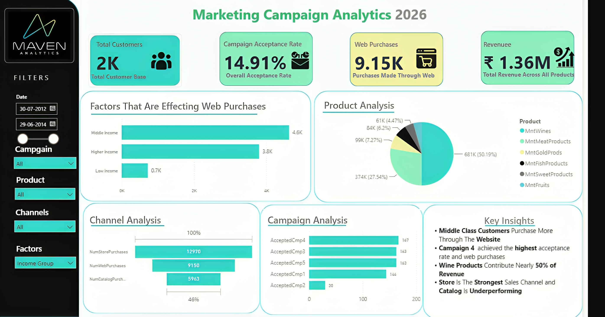
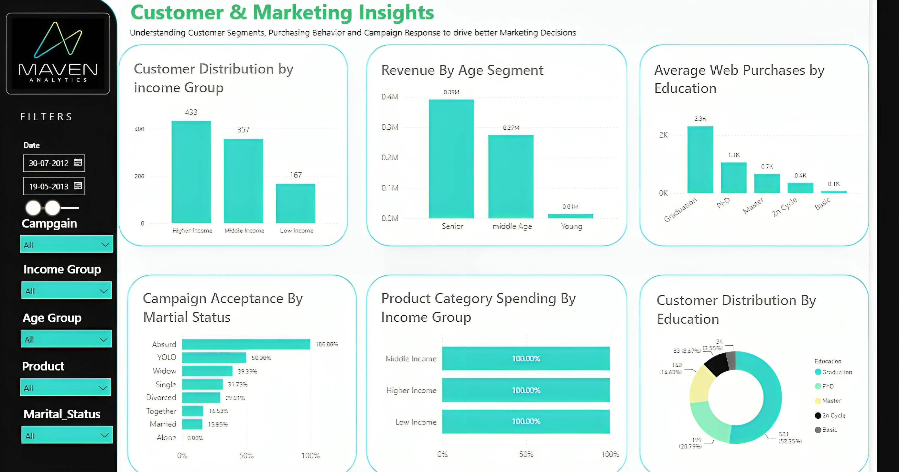

# Maven Marketing — Customer Campaign Analysis

SQL-driven analysis of 2,240 Maven Marketing customers, covering campaign performance, product concentration, channel behavior, and what actually predicts a web purchase — built on MySQL, visualized in Power BI.

## Project Overview

Maven Marketing ran six promotional campaigns and sells across three channels: web, catalog, and in-store. This project cleans the customer dataset in Excel, loads it into MySQL for QA checks and business analysis, and visualizes the results in a two-page Power BI dashboard, to answer: which campaign worked, what the average customer looks like, which products carry the business, and which channel is underperforming.

## Business Problem

Campaign and merchandising decisions were being made without a clear read on conversion. Six campaigns had been run with no consolidated comparison of their acceptance rates, product spend was never broken down by category to check for concentration risk, and nobody had checked whether web traffic volume actually predicts web purchases. This project answers all three, on top of a documented QA pass, so the numbers behind the dashboard can be trusted.

Full problem statement and goals: [`docs/business_context.md`](docs/business_context.md)
Requirements traced to each deliverable: [`docs/requirements.md`](docs/requirements.md)

## Tech Stack

| Tool | Role |
|---|---|
| Excel | Initial cleaning, formatting, and `.xlsb` → `.csv` conversion |
| MySQL | Schema, QA checks, and all business analysis queries |
| Power BI | Two-page interactive dashboard and DAX measures |

## Data Source

`marketing_data.xlsb` — a public-domain Maven Analytics dataset, one flat table, 2,240 customers, 28 columns. Every column is documented in [`docs/marketing_data_dictionary.csv`](docs/marketing_data_dictionary.csv).

## Folder Structure

```
maven-marketing-campaign-analysis/
├── data/
│   └── raw/                 # not committed — see data/raw/README.md to reproduce
├── sql/
│   ├── 01_create_schema.sql
│   ├── 02_data_quality_checks.sql
│   └── 03_business_analysis.sql
├── dashboards/
│   └── screenshots/
├── docs/
│   ├── business_context.md
│   ├── requirements.md
│   └── marketing_data_dictionary.csv
├── .gitignore
├── LICENSE
└── README.md
```

## Setup Instructions

```bash
git clone https://github.com/saitejanarla123/maven-marketing-campaign-analysis.git
cd maven-marketing-campaign-analysis
```

1. Download `marketing_data.xlsb` from [Maven Analytics](https://mavenanalytics.io/data-playground), clean it in Excel, and save it as `data/raw/marketing_data.csv` (see `data/raw/README.md`).
2. Enable local file loading on your MySQL client and server:
   ```sql
   SET GLOBAL local_infile = 1;
   ```
3. Run the scripts in order from a MySQL client with `--local-infile=1`:
   ```bash
   mysql --local-infile=1 -u root -p < sql/01_create_schema.sql
   mysql --local-infile=1 -u root -p < sql/02_data_quality_checks.sql
   mysql --local-infile=1 -u root -p < sql/03_business_analysis.sql
   ```
4. Open Power BI Desktop and connect to the `maven_marketing` database to rebuild the dashboard.

## Pipeline Flow

1. Raw data is cleaned in Excel and exported to CSV.
2. `01_create_schema.sql` creates the `maven_marketing` database and the `customers` table, then loads the CSV.
3. `02_data_quality_checks.sql` runs null, duplicate, and outlier checks against the loaded table and documents what it finds.
4. `03_business_analysis.sql` runs six sets of queries against `customers`, one per business question, each with the actual result documented inline for verification.
5. Power BI connects to the `customers` table for the dashboard.

## Output / Screenshots

**Page 1 — Executive Overview**



**Page 2 — Customer & Marketing Insights**



## Key Findings

- **Web purchases track income and household composition, not site traffic.** Store purchases (+0.50) and income (+0.38) are the strongest positive correlates; having young kids at home is the strongest negative one (‑0.36). Monthly web visit count barely correlates with purchases at all (‑0.06) — more traffic isn't converting into more sales.
- **The most recent campaign outperformed every prior one by a wide margin** — a 14.9% acceptance rate versus 6.4%–7.5% for the five earlier campaigns. Among those five, Campaign 4 edges out Campaigns 3 and 5, and Campaign 2 is the clear laggard at 1.3%. Across all six campaigns combined, only 27% of customers ever accepted an offer.
- **The average customer** is around 45 years old, earns roughly $52K, most likely holds a Graduation-level degree, is married or in a relationship, and has a kid or teenager at home about 7 times out of 10. They spend around $606 across the six product categories over two years and buy more in-store than online or by catalog.
- **Wine and meat carry the business.** Wine alone is ~50% of total product revenue, and wine + meat together account for ~78%. Fruit, sweets, and fish each sit under 5%, which is a real concentration risk if either flagship category ever softens.
- **Catalog is the underused channel**, trailing both store and web by a wide margin — and the customers who do buy by catalog are largely the same higher-spending customers active on the other channels, not a separate audience. Deal-driven purchases are the lowest-volume channel of the four.

## Data Quality Notes

The QA pass in `02_data_quality_checks.sql` flags a few things worth knowing about before this data gets used for anything beyond this analysis:
- 3 customers show `Year_Birth` values of 1893, 1899, and 1900 — implausible ages.
- 1 customer shows an income of 666,666 — a repeating-digit value that reads like a placeholder rather than a real figure.
- 7 customers use non-standard `Marital_Status` values (`Alone`, `YOLO`, `Absurd`).

These are documented in the query output rather than removed from the table, since the source cleaning was done upstream in Excel — the SQL script here is a check on what made it into the database, not a second cleaning pass.

## Lessons Learned

Checking the loaded data in SQL after cleaning in Excel caught a few edge cases worth a second look — a reminder that a QA pass at the database layer is still worth running even after the data's already been through one cleaning step, since it's a different tool looking at the same data with fresh eyes.

## Future Enhancements

- Bring in session-level or clickstream data to understand *why* web visits aren't converting, rather than just confirming that they don't.
- A/B test framework for comparing future campaigns on equal footing, rather than a single "most recent" campaign against five historical ones collected differently.

## Recruiter Notes

For non-technical reviewers: this project takes a cleaned customer export, runs it through SQL to answer six specific business questions, and turns the results into a dashboard showing which marketing campaign worked, which products and channels are carrying the business, and who the average customer actually is.

## Author + License

**Narla Sai Teja** — [LinkedIn](https://linkedin.com/in/your-profile) *(update with your actual URL before publishing)* · [GitHub](https://github.com/saitejanarla123)

Licensed under the MIT License — see [`LICENSE`](LICENSE).
